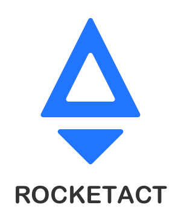

<p align="center">
  <a href="#">
    
  </a>
</p>

<p align="center">🚀 Developing React projects with ease</p>

<p align="center">
  <a href="https://travis-ci.org/jdf2e/rocketact/builds"></a>
  <a href="https://www.npmjs.com/package/rocketact"></a>
</p>
<p align="center">
  <a href="https://david-dm.org/jdf2e/rocketact?path=packages%2Frocketact-scripts&view=list"></a>
  <a href="https://codeclimate.com/github/jdf2e/rocketact"></a>
  <a href="https://www.npmjs.com/package/rocketact"></a>
  <a href="http://makeapullrequest.com"></a>
</p>
## Features

- ⚡️ Zero configuration
- 👏 Supports both Single-Page Application and Multi-Page Application
- 📤 Supports [TypeScript](https://www.typescriptlang.org/)、[Sass](https://sass-lang.com/)、[PostCSS](https://postcss.org/) out of box
- 🖥 Full-featured web console
- 🕹 Fully control over every step of the build process

## Usage

With [`npx`](https://blog.npmjs.org/post/162869356040/introducing-npx-an-npm-package-runner), you can run:

```bash
npx rocketact create my-awesome-project
```

Or you can install `rocketact` globaly:

```bash
npm install -g rocketact
rocketact create my-awesome-project
```

then you can:

```bash
cd my-awesome-project
npm start
// or
yarn start
```

## Packages


| Name  | Description | Meta |
|---|---|---|
| rocketact  | commandline tool to create new projects  |   <a href="https://david-dm.org/jdf2e/rocketact?path=packages%2Frocketact&view=list"></a>  |
| rocketact-scripts | main functionality resides here |   <a href="https://david-dm.org/jdf2e/rocketact?path=packages%2Frocketact-scripts&view=list"></a>  |
|  rocketact-dev-utils | common utils shared by other packages |    <a href="https://david-dm.org/jdf2e/rocketact?path=packages%2Frocketact-dev-utils&view=list"></a> |
|  rocketact-web-console | web console core |   <a href="https://david-dm.org/jdf2e/rocketact?path=packages%2Frocketact-web-console&view=list"></a>  |
|  rocketact-plugin-polyfill | automatically setup polyfill configuration |   <a href="https://david-dm.org/jdf2e/rocketact?path=packages%2Frocketact-plugin-polyfill&view=list"></a>  |
|  rocketact-plugin-bundle-analyzer | add [webpack-bundle-analyzer](https://github.com/webpack-contrib/webpack-bundle-analyzer) intergation for Rocketact projects |   <a href="https://david-dm.org/jdf2e/rocketact?path=packages%2Frocketact-plugin-bundle-analyzer&view=list"></a>  |
|  rocketact-plugin-butler | add compatibility for legacy Butler projects |    <a href="https://david-dm.org/jdf2e/rocketact?path=packages%2Frocketact-plugin-butler&view=list"></a> |

## Development

Use Node >= 10 version as **development environment**.

### Prepare

```bash
git clone https://github.com/jdf2e/rocketact.git
cd rocketact
yarn && yarn bootstrap
cd packages/rocketact-scripts/test/fixture/simple/ && yarn && cd -
```

### Build

```bash
yarn build
```

### Testing

```bash
yarn test
```

While developing, you can start `jest` in watch mode:

```bash
yarn test -- --watch
```

### Commit Changes

```bash
yarn commit
```