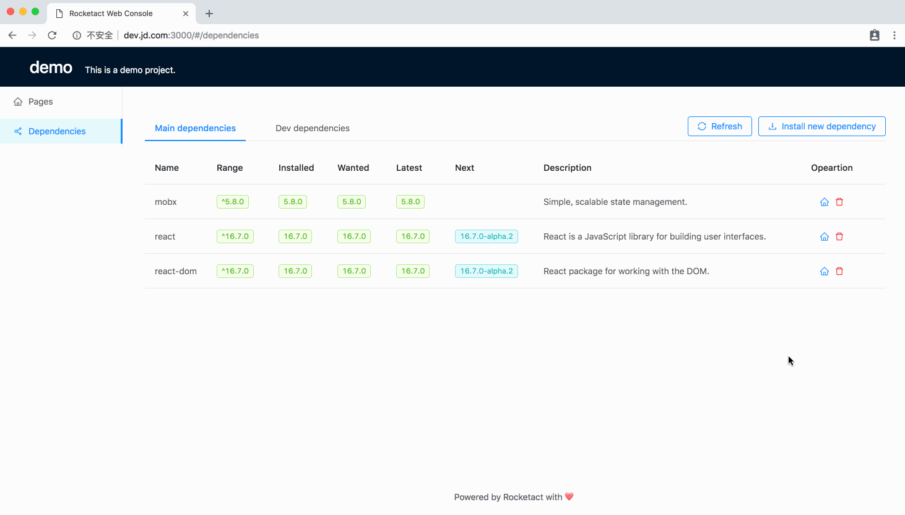

In the ["Dependencies" tab](http://dev.jd.com:3000/#/dependencies) of web console, you can view/manage your project dependencies without opening the terminal.

## Upgrading Dependency

To upgrade a outdated dependency, all you need is to choose the version you want upgrade to and click the "OK" button.

## Removing Dependency

Removing dependency is similar.

## Adding New Dependency

To add a new dependency, open the "Install new dependency" dialog and search the package you want. Then choose whether install it as a main dependency or dev dependency.

